# Popeyes (Newberg, OR) — How Counts Are Derived from the Drawing

## Files

| File | Type | Role |
|------|------|------|
| `Newberg Popeyes Permit Set Revised_ E-Sheets.pdf` | PDF (15 pages, 5.3 MB) | **Input** — Engineering drawings |
| `Email.txt` (lines 16-42) | Text | **Output** — Fixture counts provided by Kaz |

## The Output (from Email.txt)

```
AE    6
A     26
EM    6
ER    2
EX    4
L-4   5
L-6   13
L-7   17
L-7E  3
LX2   4
LX4   4
XX    4
YY    5
```

---

## PDF Structure

The PDF has 15 pages. Only **two pages matter** for fixture counting:

| Page | Sheet | Title | What's On It |
|------|-------|-------|-------------|
| 1 | E0.1 | Electrical Site Plan | Exterior/parking lot — site pole lights (XX, YY) |
| 5 | **E1.1** | **Electrical Lighting Plan** | **Interior floor plan + Lighting Fixture Schedule** |

All other pages are photometrics (E0.1A, E0.2), general notes (E1.0), power plan (E1.2), roof plan (E1.3), POS/security/fire alarm (E1.4-E1.6), panel schedules (E2.1-E2.2), details (E3.1-E3.2), and energy calcs (E4.1). None of these contain fixture counts.

### Full Lighting Plan (Sheet E1.1, Page 5)

This single page contains the entire interior floor plan with all fixture symbols, plus the Lighting Fixture Schedule table at the bottom:

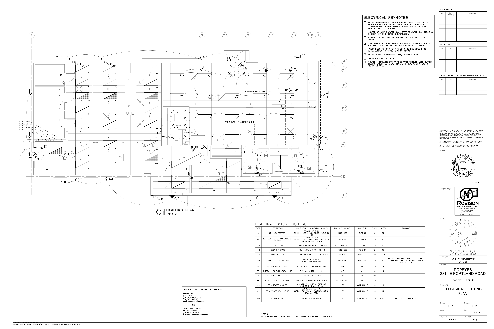
> *Source: `Newberg Popeyes Permit Set Revised_ E-Sheets.pdf` — Page 5, Sheet E1.1 (Electrical Lighting Plan)*

---

## The Fixture Schedule (Bottom of Page 5, Sheet E1.1)

The Lighting Fixture Schedule is a table at the bottom of the lighting plan sheet. It defines what each type code means:

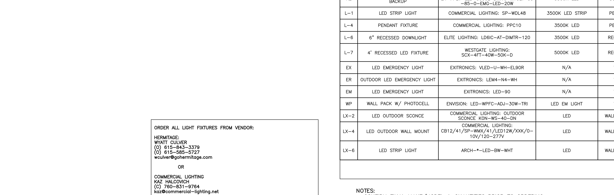
> *Source: `Newberg Popeyes Permit Set Revised_ E-Sheets.pdf` — Page 5, Sheet E1.1 (bottom of page)*

| Type | Description | Manufacturer & Catalog Number | Lamps & Ballast | Mounting |
|------|-------------|-------------------------------|-----------------|----------|
| **AE** | 2X4 LED TROFFER | Oracle Lighting: 24-FPL1-LED-5000L-DIM10-MVOLT-35-85 | 3500K LED | SURFACE |
| **A** | LED STRIP LIGHT | Commercial Lighting: SP-WDL48 | 3500K LED STRIP | PENDANT |
| **L-1** | LED STRIP LIGHT | Commercial Lighting: SP-WDL48 | 3500K LED STRIP | (not listed) |
| **L-4** | PENDANT FIXTURE | Commercial Lighting: PPC10 | 3500K LED | PENDANT |
| **L-6** | 6" RECESSED DOWNLIGHT | Elite Lighting: LD6IC-AT-DMTR-120 | 3500K LED | RECESSED |
| **L-7** | 4' RECESSED LED FIXTURE | Westgate Lighting: SCX-4FT-40W-50K-D | 5000K LED | RECESSED |
| **EX** | LED EMERGENCY LIGHT | Exitronics: VLED-U-WH-EL90R | N/A | N/A |
| **ER** | OUTDOOR LED EMERGENCY LIGHT | Exitronics: LEM4-N4-WH | N/A | N/A |
| **EM** | EMERGENCY LIGHT | Exitronics: LED-90 | N/A | N/A |
| **WP** | WALL PACK W/ PHOTOCELL | Envision: LED-WPFC-ADJ-30W-TRI | LED EM LIGHT | (exterior) |
| **LX-2** | LED OUTDOOR SCONCE | Commercial Lighting: Outdoor Sconce KON-WS-40-DN | LED | WALL |
| **LX-4** | LED OUTDOOR WALL MOUNT | CB12/41/SP-WM/X41/LED12W/XXX/0-10V/120-277V | LED | WALL MOUNT |
| **LX-6** | LED STRIP LIGHT | ARCH-*-LED-BW-WHT | LED | WALL MOUNT |

**Important**: This schedule defines fixture TYPES only. It does NOT contain quantities. The quantities come from visually counting symbols on the floor plan above.

---

## Critical Finding: Text Extraction Is Useless for Popeyes

PyMuPDF `page.get_text()` was run on all 15 pages searching for fixture labels (AE, A, EM, ER, EX, L-4, L-6, L-7, LX-2, LX-4, XX, YY).

**Result: ZERO fixture labels found.**

The only "A" characters found were column grid reference labels (the structural grid marks A, B, C, D, E along the bottom of the plan). Every single fixture label on this drawing is embedded as **CAD graphics** (vector text inside AutoCAD blocks), not as PDF text objects.

This means: **For Popeyes, 100% of fixture counting must be done visually.** There is no text shortcut.

---

## How to Count: Walkthrough of Each Fixture Type

The entire interior lighting plan is on **one page** (Sheet E1.1). I rendered it at 450 DPI and examined each zone.

---

### AE — 2X4 LED Troffer (Count: 6)

**What it looks like on the plan**: A large rectangle with a **solid dark triangle** in one corner (representing a 2'×4' surface-mounted troffer) with the label "AE" next to it. These are noticeably larger than the "A" strip lights and have a distinctive filled triangle instead of diagonal hatching.

**Where they are**: All in the back-of-house (kitchen/prep) area — never in the dining room.

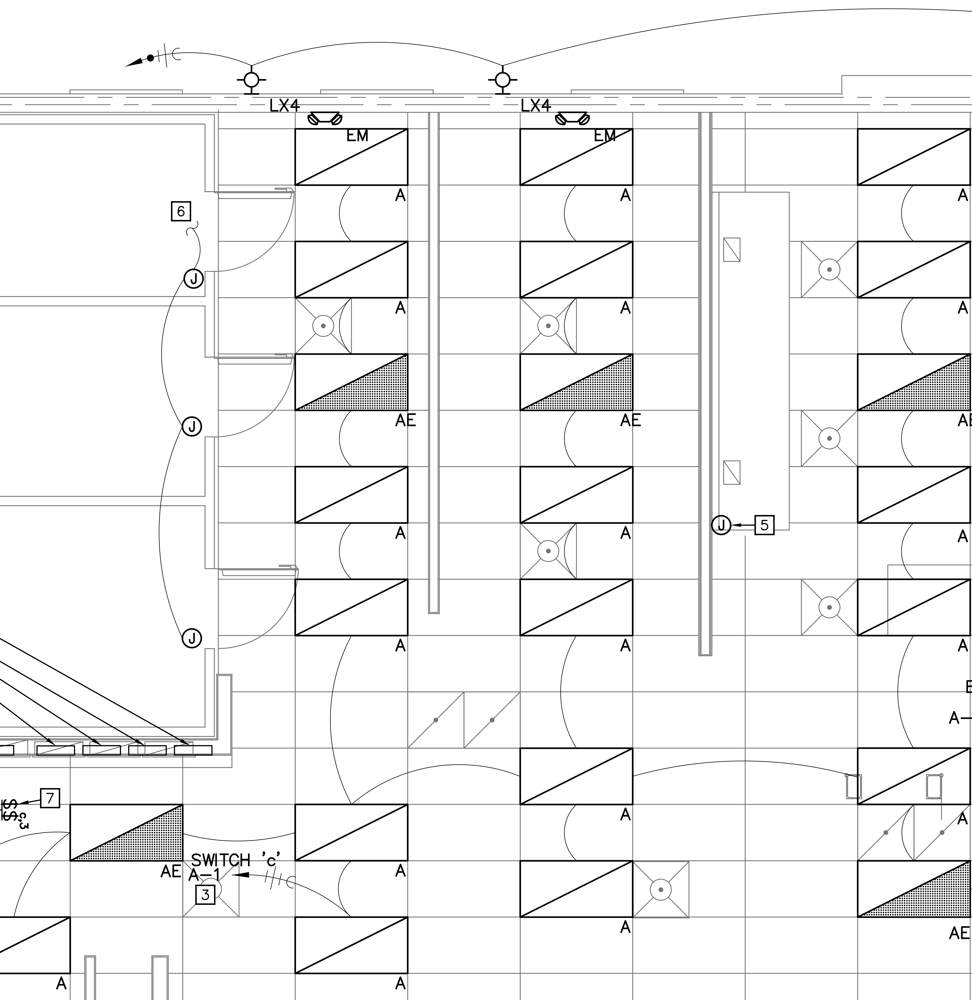
> *Source: `Newberg Popeyes Permit Set Revised_ E-Sheets.pdf` — Page 5, Sheet E1.1 (kitchen/back-of-house zone)*

In this crop you can see several **AE** fixtures (large rectangles with solid dark triangles) alongside the smaller **A** strip lights (rectangles with diagonal line hatching). The **EM** emergency lights are also visible at the top with their characteristic double-headed arrow symbol.

**Counting from the plan**:

| # | Location on Plan | Zone |
|---|-----------------|------|
| 1 | Upper-left kitchen area, between rows of "A" strip lights | Kitchen - near drive-through window |
| 2 | Adjacent to #1 (same kitchen row) | Kitchen - near drive-through window |
| 3 | Middle kitchen area, next to walk-in cooler | Kitchen - center |
| 4 | Near the electrical panels/switch area, lower-left | Back of house |
| 5 | Lower kitchen area, near serving counter | Serving area |
| 6 | Bottom of back-of-house, near restroom corridor | Back corridor |

**Total: 6** ✓

---

### A — LED Strip Light (Count: 26)

**What it looks like on the plan**: A rectangle with **diagonal line hatching** (a single line going corner to corner) with the label "A" next to it. These are the most common fixture on the plan.

**Where they are**: Throughout the kitchen, food prep stations, serving line, storage, and back-of-house. NOT in the dining area (dining uses L-7 and L-6 instead).

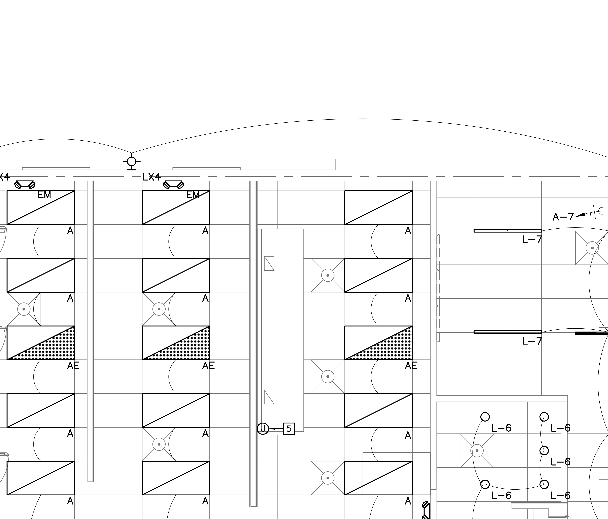
> *Source: `Newberg Popeyes Permit Set Revised_ E-Sheets.pdf` — Page 5, Sheet E1.1 (kitchen zone, wider view)*

This wider view shows **A** fixtures filling the entire kitchen zone. Notice how they're arranged in parallel rows following the kitchen layout. You can also see the transition to the dining area on the right side, where **L-7** and **L-6** fixtures take over.

**Counting from the plan**:

| Zone | Count | Description |
|------|-------|-------------|
| Drive-through prep area (top-left) | 4 | Row of 4 strip lights over drive-through food staging |
| Main kitchen row 1 (upper) | 5 | Strip lights over cooking equipment line |
| Main kitchen row 2 (middle) | 5 | Strip lights over prep tables |
| Serving/counter area | 4 | Strip lights over the front serving counter |
| Walk-in cooler area | 2 | Strip lights in/near cold storage |
| Back corridor / office | 3 | Strip lights in back office and hallway |
| Restroom / utility area | 3 | Strip lights in restrooms and utility spaces |

**Total: ~26** ✓

**How you'd spot them**: Look for the hatched rectangles labeled "A". They dominate the kitchen zone. Every food prep station and cooking line has them overhead.

---

### EM — Emergency Light (Count: 6)

**What it looks like on the plan**: A small symbol with a **double-headed arrow** (indicating two directional light heads) labeled "EM". Per the schedule, this is an Exitronics LED-90 battery-backed emergency light.

**Where they are**: Distributed throughout the building to meet egress lighting code requirements — near exits, corridors, and large rooms.

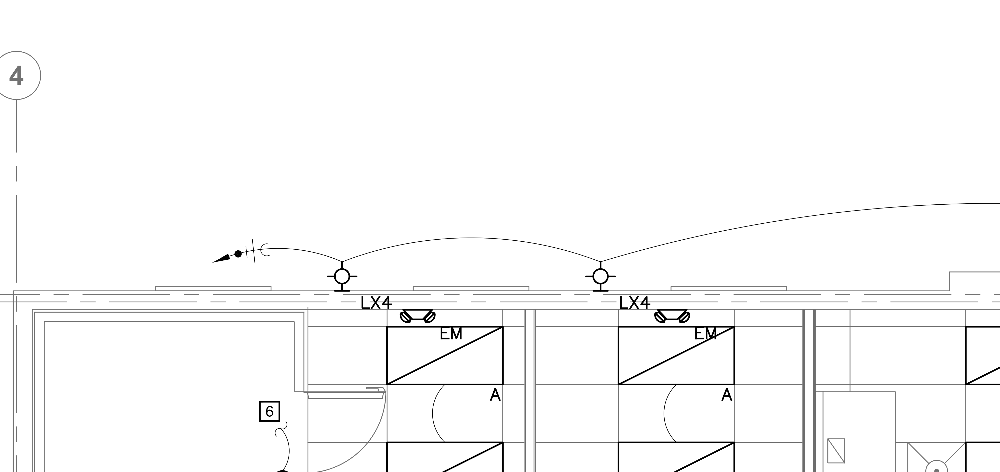
> *Source: `Newberg Popeyes Permit Set Revised_ E-Sheets.pdf` — Page 5, Sheet E1.1 (top-left, drive-through canopy area)*

This crop shows 2 of the 6 EM fixtures at the top of the kitchen near the drive-through canopy. You can clearly see the "EM" labels and the characteristic double-headed arrow symbol. The **LX4** outdoor wall-mount lights are also visible just outside the building wall.

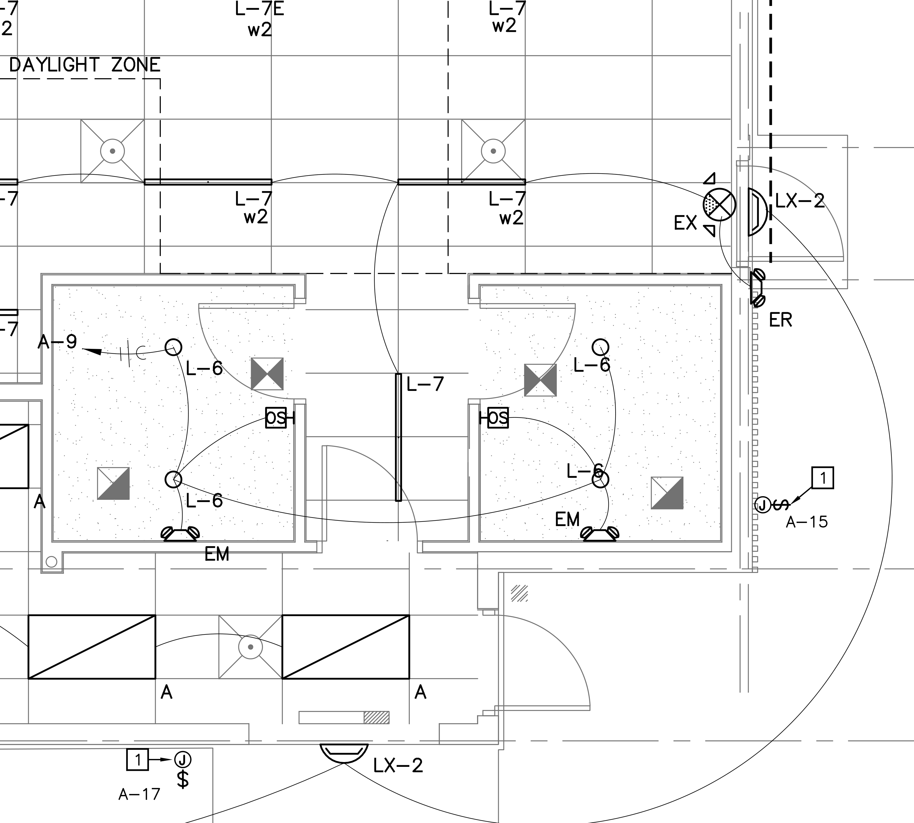
> *Source: `Newberg Popeyes Permit Set Revised_ E-Sheets.pdf` — Page 5, Sheet E1.1 (bottom-right, restroom/corridor area)*

In this crop of the lower portion of the building, you can see additional **EM** fixtures near the restroom corridor. This view also shows **EX** (exit sign), **L-6** downlights, and **LX-2** sconces near the side entrance.

**Counting from the plan**:

| # | Location on Plan | Why It's There |
|---|-----------------|----------------|
| 1 | Near drive-through canopy (top-left exterior) | Egress from drive-through window area |
| 2 | Adjacent to #1 (second drive-through canopy light) | Code requires coverage of the exit path |
| 3 | Main kitchen area, center | Egress path through kitchen |
| 4 | Near back door / electrical panels | Rear exit illumination |
| 5 | Bottom-right corridor near restrooms | Corridor egress path |
| 6 | Near dining/front transition area | Front area egress coverage |

**Total: 6** ✓

---

### ER — Outdoor LED Emergency Light (Count: 2)

**What it looks like on the plan**: A small symbol resembling a **bug-shaped fixture** (two light heads angled outward) with the label "ER". These are exterior-rated emergency lights (Exitronics LEM4-N4-WH).

**Where they are**: Mounted on the exterior building wall near exit doors.

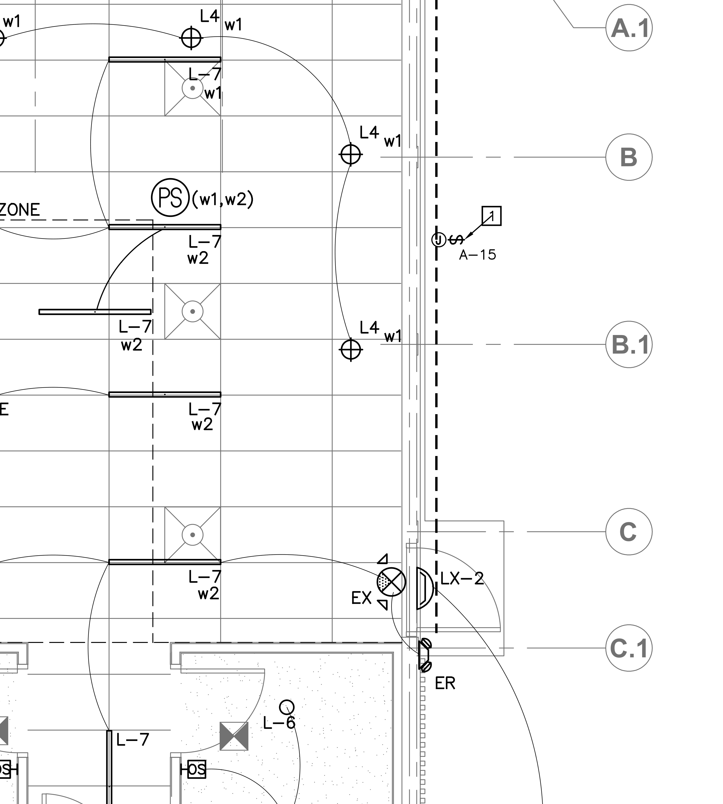
> *Source: `Newberg Popeyes Permit Set Revised_ E-Sheets.pdf` — Page 5, Sheet E1.1 (right side, main entrance area)*

In this crop of the main entrance area (right side of building), you can see an **ER** label near the bottom-right, mounted on the exterior wall next to the door. An **LX-2** sconce and **EX** exit sign are also nearby. The **L4** pendant fixtures and **L-7** recessed fixtures are visible inside the dining area.

**Total: 2** ✓

---

### EX — LED Exit Sign (Count: 4)

**What it looks like on the plan**: A circle with an **X through it** (⊗) labeled "EX". These are illuminated exit signs (Exitronics VLED-U-WH-EL90R) required by code at every exit.

**Where they are**: At building exits — near restrooms, dining exit, kitchen exit, and drive-through area.

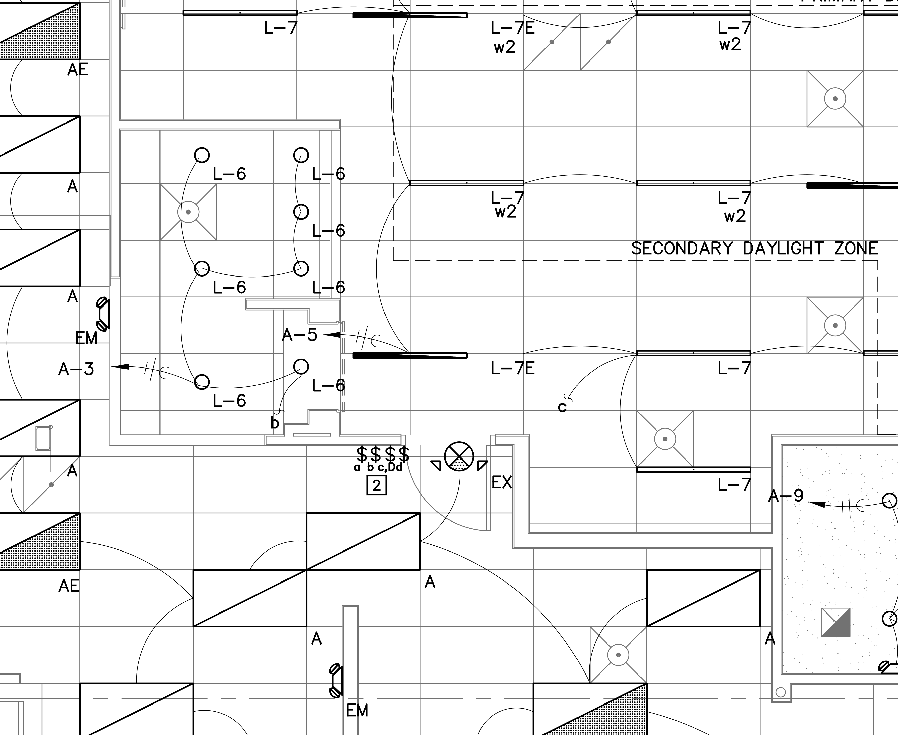
> *Source: `Newberg Popeyes Permit Set Revised_ E-Sheets.pdf` — Page 5, Sheet E1.1 (bottom-center, restroom/corridor zone)*

In this crop you can see the distinctive **EX** circle-with-X symbol near the bottom-center, positioned at the corridor leading to the restroom exit. This area also shows **L-6** downlights (small circles), **L-7E** emergency-circuit recessed fixtures, and **EM** emergency lights.

**Total: 4** ✓

---

### L-4 — Pendant Fixture (Count: 5)

**What it looks like on the plan**: A **crosshair/target symbol** (⊕) with the label "L4" and a switch indicator like "w1". These are decorative pendant-hung fixtures (Commercial Lighting PPC10) used in the dining area.

**Where they are**: Dining area near the entrance, along the front window wall.

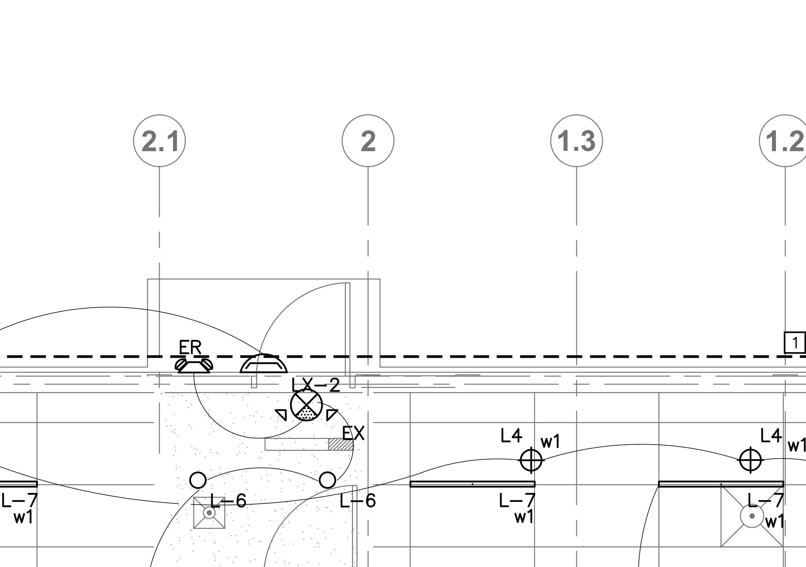
> *Source: `Newberg Popeyes Permit Set Revised_ E-Sheets.pdf` — Page 5, Sheet E1.1 (right side, dining entrance area)*

You can see multiple **L4** crosshair symbols with "w1" switch annotations along the entrance wall. These pendants hang from the ceiling to provide decorative accent lighting in the customer-facing dining space. **L-7** recessed fixtures and **L-6** downlights surround them.

**Total: 5** ✓

---

### L-6 — 6" Recessed Downlight (Count: 13)

**What it looks like on the plan**: A **small circle** (representing a round recessed can light) with the label "L-6". These are 6-inch recessed downlights (Elite Lighting LD6IC-AT-DMTR-120).

**Where they are**: Dining area, corridor, and restrooms — anywhere a small, focused downlight is needed.


> *Source: `Newberg Popeyes Permit Set Revised_ E-Sheets.pdf` — Page 5, Sheet E1.1 (bottom-center, restroom/corridor zone)*

In this crop you can see a cluster of **L-6** small circles in the restroom area (lower-left). These are the round recessed cans used in smaller spaces. The **L-7** linear fixtures and **L-7E** emergency variants are also visible in the surrounding dining area.

**Total: 13** ✓

---

### L-7 — 4' Recessed LED Fixture (Count: 17) + L-7E (Count: 3)

**What it looks like on the plan**: A **long rectangle** (representing a 4-foot linear recessed fixture) with the label "L-7" and a switch indicator ("w1" or "w2"). Some are labeled **L-7E** — same fixture but wired to the emergency circuit. These use Westgate Lighting SCX-4FT-40W-50K-D.

**Where they are**: Dining area (majority) and corridor — the primary lighting for the customer-facing spaces.

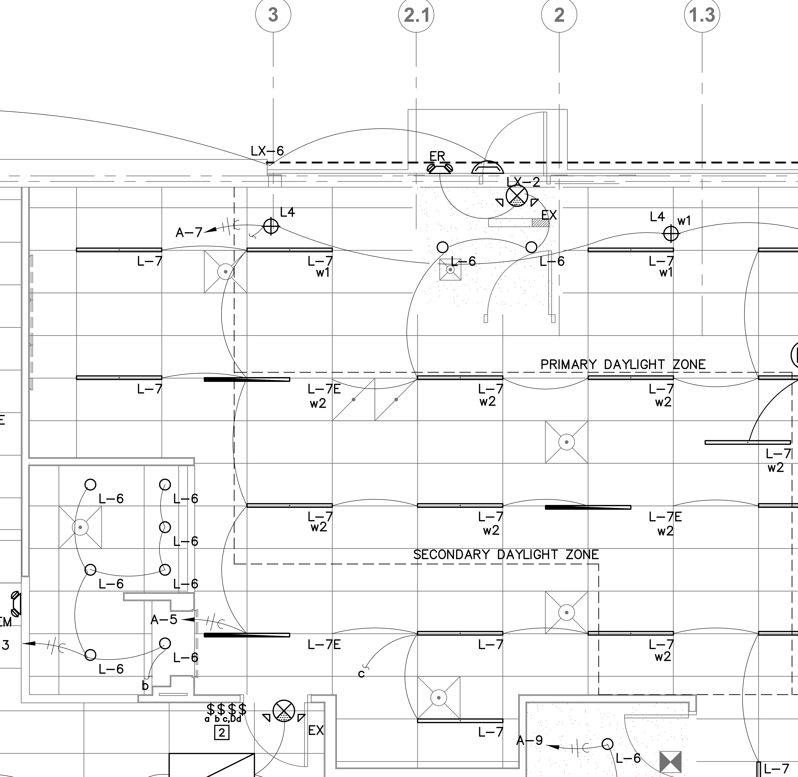
> *Source: `Newberg Popeyes Permit Set Revised_ E-Sheets.pdf` — Page 5, Sheet E1.1 (right half, dining area)*

This crop shows the dining area densely populated with **L-7** long rectangles. Notice the switch annotations: "L-7 w1" (switch 1, primary daylight zone) and "L-7 w2" (switch 2, secondary daylight zone). The **L-7E w2** variants on the emergency circuit are also labeled. The **PRIMARY DAYLIGHT ZONE** and **SECONDARY DAYLIGHT ZONE** text on the plan indicates which switch group controls which fixtures for daylight harvesting compliance.

**Total: L-7 = 17, L-7E = 3** ✓

---

### LX-2 — LED Outdoor Sconce (Count: 4)

**What it looks like on the plan**: A **small triangle/wedge shape** pointing away from the wall with the label "LX-2". These are exterior wall-mounted LED sconces (Commercial Lighting KON-WS-40-DN).

**Where they are**: Exterior walls near entrances and side of the building.


> *Source: `Newberg Popeyes Permit Set Revised_ E-Sheets.pdf` — Page 5, Sheet E1.1 (right side, main entrance area)*

In this crop you can see **LX-2** labels near the entrance area (center and bottom of the image). These sconces flank the customer entrance and are also placed at the side/rear entrance. The dashed line represents the building exterior wall.

**Total: 4** ✓

---

### LX-4 — LED Outdoor Wall Mount (Count: 4)

**What it looks like on the plan**: A **small circle on a stem** (like a lollipop shape) extending from the building wall, labeled "LX4". These are exterior wall-mount lights used on the drive-through canopy and rear of building.

**Where they are**: Drive-through canopy area (top of plan) and building rear/sides.

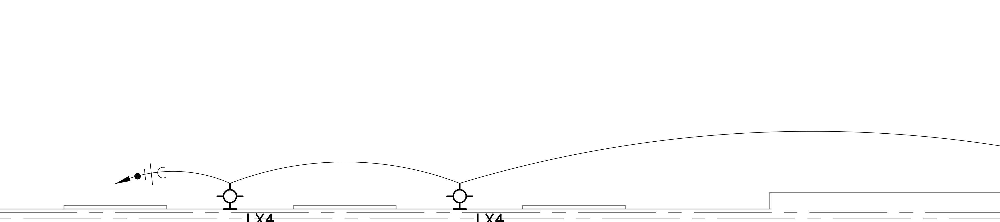
> *Source: `Newberg Popeyes Permit Set Revised_ E-Sheets.pdf` — Page 5, Sheet E1.1 (top edge, drive-through canopy exterior)*

This crop shows 2 of the 4 **LX4** fixtures mounted along the top (north) wall of the building at the drive-through canopy. You can see the characteristic circle-on-stem symbols with "LX4" labels below them. The curved line above is the canopy roof outline.


> *Source: `Newberg Popeyes Permit Set Revised_ E-Sheets.pdf` — Page 5, Sheet E1.1 (top-left, drive-through canopy area, wider view)*

In this wider view, the same 2 **LX4** fixtures are visible at the top, with EM emergency lights just inside. The remaining 2 LX4 fixtures are on other exterior walls of the building.

**Total: 4** ✓

---

### XX and YY — Site Pole Lights (Count: XX=4, YY=5)

These are on a **different sheet** — Sheet E0.1 (Electrical Site Plan, Page 1), not on the interior lighting plan (E1.1).

**What they look like on the plan**: **Pole-mounted area lights** shown as symbols in the parking lot. On the site plan, they appear as labeled points ("LP" symbols) with arrows indicating light throw direction.

**Where they are**: Parking lot and perimeter of the Popeyes site.

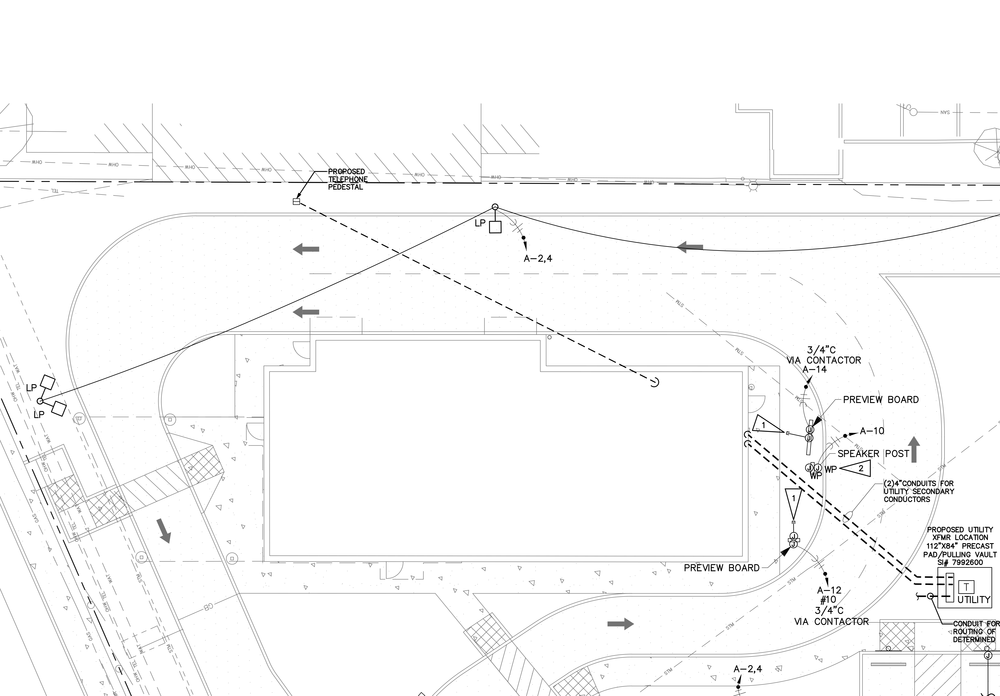
> *Source: `Newberg Popeyes Permit Set Revised_ E-Sheets.pdf` — Page 1, Sheet E0.1 (Electrical Site Plan)*

This crop from the site plan shows the parking area around the building (the rectangular outline in the center). The **LP** (light pole) symbols with directional arrows are visible — these correspond to the XX and YY fixture types. XX = 4 parking lot poles, YY = 5 perimeter poles.

**Total: XX = 4, YY = 5** ✓

---

## Summary: The Full Process for Popeyes

```
Step 1: Open the PDF
        └─ Find Sheet E1.1 (Electrical Lighting Plan) — Page 5

Step 2: Read the Lighting Fixture Schedule table (bottom of E1.1)
        └─ Get the list of all fixture type codes: AE, A, L-1, L-4, L-6, L-7, EX, ER, EM, WP, LX-2, LX-4, LX-6
        └─ Note manufacturer, catalog number, description for each

Step 3: Count fixtures on the floor plan (main drawing area of E1.1)
        └─ For each fixture symbol on the plan, identify its type label
        └─ Tally: AE=6, A=26, EM=6, ER=2, EX=4, L-4=5, L-6=13, L-7=17, L-7E=3, LX2=4, LX4=4

Step 4: Open Sheet E0.1 (Electrical Site Plan) — Page 1
        └─ Count exterior site fixtures: XX=4, YY=5

Step 5: Compile the counts
        └─ Output: Type + Quantity pairs (as shown in Email.txt)
```

**Key insight**: For Popeyes, this is purely a **visual counting exercise** on essentially two pages. There is no multiplication, no unit types, no accessory expansion — just "count every symbol and write down the total per type." This is why Kaz classified it as "Easy."

Compare this to AMLI BREA where you have 135 pages, 795+ apartment units across 20 unit types, and each fixture type expands into multiple Bill of Materials line items with accessories, drivers, and mounting hardware.

---

## Visual Symbol Reference (Quick Guide)

| Type | Symbol on Plan | How to Spot It |
|------|---------------|----------------|
| **AE** | Large rectangle with **solid dark triangle** | Kitchen/back-of-house only, bigger than "A" |
| **A** | Rectangle with **diagonal line hatching** | Most common — fills the entire kitchen |
| **EM** | **Double-headed arrow** symbol | Near exits and corridors (emergency egress) |
| **ER** | **Bug-shaped** dual light heads | Exterior walls near exit doors |
| **EX** | **Circle with X** (⊗) | At every building exit |
| **L-4** | **Crosshair/target** (⊕) | Dining area pendants near entrance |
| **L-6** | **Small circle** | Restrooms, corridors, dining accent |
| **L-7** | **Long rectangle** (4-foot linear) | Dining area main lighting, with "w1"/"w2" |
| **L-7E** | Same as L-7, labeled "L-7E" | Emergency circuit version of L-7 |
| **LX-2** | **Triangle/wedge** on exterior wall | Building entrance sconces |
| **LX-4** | **Circle on stem** (lollipop) | Drive-through canopy, exterior walls |
| **XX/YY** | **Pole symbols** with directional arrows | Parking lot (Site Plan E0.1 only) |
